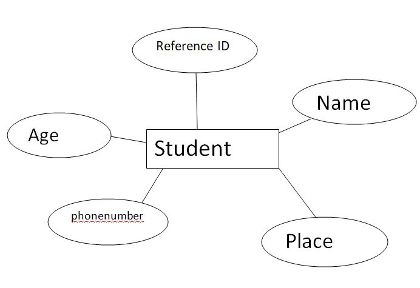
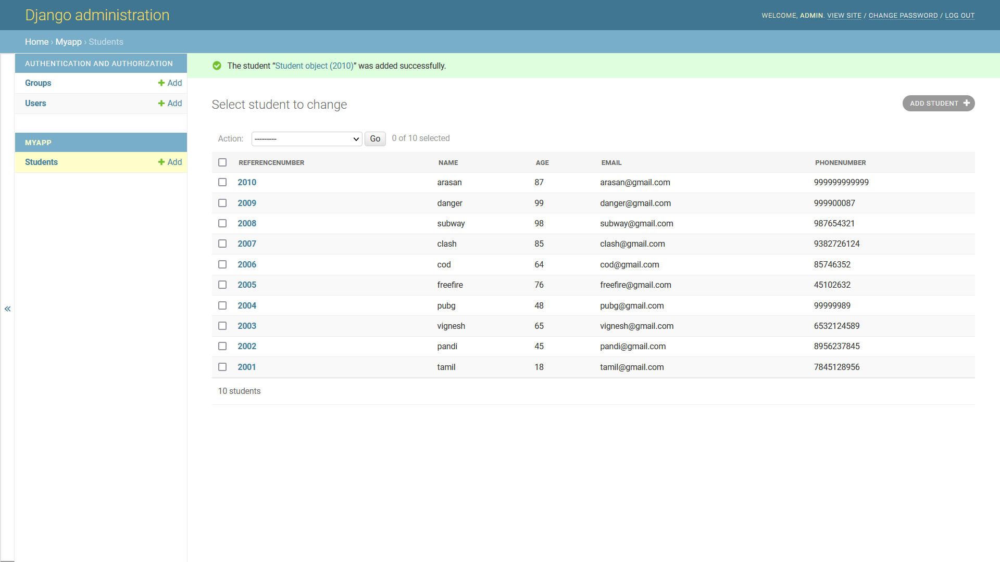
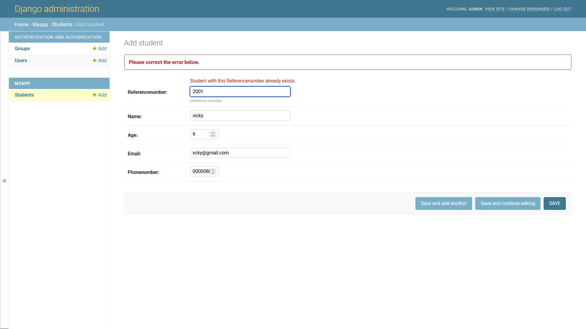

# Django ORM Web Application

## AIM
To develop a Django application to store and retrieve data from a database using Object Relational Mapping(ORM).

## Entity Relationship Diagram

### ER diagram:

## DESIGN STEPS

### STEP 1:Create folder 'ex02' under the directory 'unit2'

### STEP 2:Clone the github repository into the directory 'ex02' using the command "git clone <url>"

### STEP 3:Under the folder "gjango-orm-app", enter the directory titled "dataproject" and enter the folder "dataproject" and go to the file "settings.py", "import os" in line  14, set ALLOWED-HOSTS=['*'] and add 'myapp' under the l8ist INSTALLED-APPS.

### step 4:Return to the parent folder "dataproject " and install the application myapp 8using the command "python3 manage.py starapp myapp"

### step 5:Under the directory "myapp", open "models.py" and enter the code for the colum headings

### step 6:Under the directory "my app", open "admin.py" and entee=r the code to set up the admin

### step 7:Return to the parent folder "dataproject", and into the prompt, enter the command "python3 manage.py makemigration"

### step 8: Into the prompt, enter the command "python3 manage.py migrate

### step 9: create a superuser by typing the command "python3 manage.py runserver 0:8000" to run the server at port number 8000 

### step 10:Into the prompt, type the command "python3 manage.py runserver 0:8000" to run the server at port number 8000

### step 11:open the admin login page and enter the user name and password to login

### step 12:under the "myapp" section, click on "add" next to "student" to create a record. create 10 records in the same way.

### step 14:upload the screenshot into the "dataproject" directry by right-clicking on it and selecting "upload files"

### step 15:once exited from the server, type the codes necessary for pushing the files into the github repository

## PROGRAM

### Models.py:
from django.db import models
from django.contrib import admin

class Student(models.Model):
    referencenumber=models.CharField(primary_key=True,max_length=20,help_text="reference number")
    name=models.CharField(max_length=100)
    age=models.IntegerField()
    email=models.EmailField()
    phonenumber=models.IntegerField()

class StudentAdmin(admin.ModelAdmin):
    list_display=('referencenumber','name','age','email','phonenumber')

### Admin.py: 

from django.contrib import admin
from .models import student,studentAdmin

admin.site.register(student,studentAdmin)

## OUTPUT

### Student list:

### Error:

## RESULT
The program is executed sucessfully.
